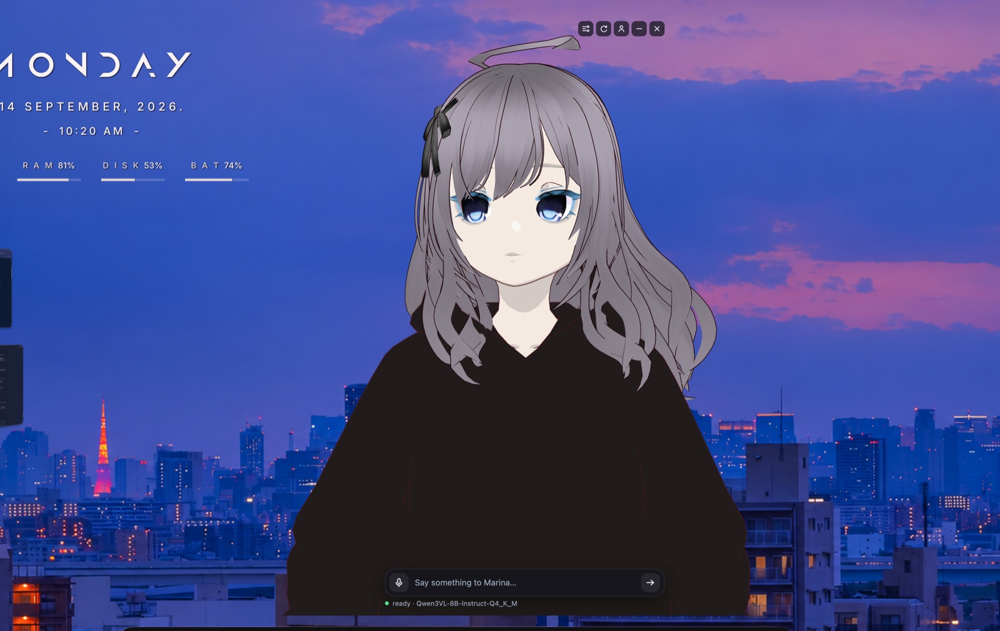

# Marina

Marina is an anime character who lives on your desktop. She sits in a
transparent window that stays on top of everything else, and you can either
talk to her out loud or type. She answers in her own voice, lip syncs while
she does it, and acts out the little stage directions she writes.



It started as a fork of [rayenfeng/riko_project](https://github.com/rayenfeng/riko_project).
That project had the voice pipeline, but the avatar frontend was still an
unchecked TODO, so I built it and split things up so the language model can run
on a different machine.

Everything apart from the language model runs on the Mac. The voice model is
local and uses about 674 MB of RAM.

## Platforms

| Platform | Status |
| --- | --- |
| macOS 13 Ventura or newer, Apple Silicon | Supported. Download the `.dmg` below. |
| macOS, Intel | Not built. The code has nothing Apple-Silicon-specific in it, so [building from source](#building-from-source) should work, but I have no Intel Mac to check it on. |
| Windows, Linux | Not supported. The Python backend is portable but the window is written against macOS. |

## Install

Download **Marina-1.0.0-arm64.dmg** from
[Releases](https://github.com/skep13/marina/releases/latest), open it and drag
Marina to Applications. That is the whole install. The app carries its own
Python, the voice model and the speech recognition model, so there is nothing
else to set up and nothing to build.

It is a big download, around 1 GB, because those models are inside it.

### Getting past Gatekeeper

I don't pay Apple $99 a year, so the app is signed ad-hoc rather than notarized.
macOS will refuse to open it the first time and say Marina "is damaged" or is
from an unidentified developer. It isn't damaged, that is just what macOS says
about any app it can't trace to a paid developer account.

Open a terminal and run this once:

```bash
xattr -dr com.apple.quarantine /Applications/Marina.app
```

Then open Marina normally. If you would rather not use a terminal, try to open
the app, then go to System Settings > Privacy & Security, scroll down, and click
**Open Anyway** next to the message about Marina.

### Giving her a brain

Marina's voice, avatar, animation and speech recognition all run on your Mac and
work the moment you open her. The language model is the one piece she can't
carry, because no model worth talking to fits in an app bundle.

By default she looks for [Ollama](https://ollama.com) on this Mac:

```bash
ollama pull llama3.2:3b
```

That is enough. If Ollama isn't running she will say so in the app rather than
failing silently.

To point her somewhere else, pick **Edit config…** from her menu bar icon and
change `llm.base_url` and `llm.api_key`. Anything OpenAI-compatible works:
llama.cpp, LM Studio, vLLM, a box on your network, or OpenAI itself. Leave
`base_url` empty to use OpenAI.

Her config, memory and chat history live in
`~/Library/Application Support/Marina/`.

## What she can do

- Sits on your desktop in a transparent, always-on-top window
- Talk to her or type
- Starts speaking before the whole reply has been generated
- You can cut her off by talking over her
- Sometimes says something without being asked
- Timers, reading the clipboard, opening links, remembering things
- Knows what day and time of day it is
- Can look at your screen when you ask (off by default)
- Lip sync with five mouth shapes
- Hair physics, blinking and eye movement
- `*actions*` in her replies play as animations instead of being read out
- Long-term memory
- Local voice (Kokoro) and speech recognition (Faster-Whisper)
- Works with any OpenAI-compatible model: Ollama, llama.cpp, LM Studio, vLLM
  or OpenAI itself

## What leaves your Mac

Your voice never leaves the Mac, in either direction, and there's no code path
that sends recorded audio anywhere. Faster-Whisper listens and
Kokoro does the talking. I checked this by watching the bridge's sockets
through a full trip, mic in and then when the reply was spoken, and the only connections
open were loopback ones.

- The clipboard tool sends whatever is on your clipboard to the model, so it's
  only as private as your LLM endpoint. Turn it off with `tools.clipboard`.
- `asr.offline: true` stops Faster-Whisper checking Hugging Face for model
  updates every time it loads.

The bridge only listens on `127.0.0.1`, so nothing else on your network can
reach it.

## Building from source

You only need this if you want to change her. To just run her, download the dmg.

### 1. Set up

```bash
./setup-mac.sh
```

This finds or installs Python 3.12 (macOS comes with 3.9, which is too old for
`onnxruntime`), creates `.venv`, installs the dependencies, downloads the Kokoro
voice model and installs the app's npm packages. It's fine to run it more than
once.

The `requirements.txt` at the root is GPT-SoVITS's dependency list (torch,
funasr, modelscope and so on). You don't need it on the Mac, which uses
`server/requirements-mac.txt`.

Keep the checkout somewhere that isn't Desktop, Documents or Downloads. macOS
protects those three with TCC, and a venv inside them is awkward to run from.

### 2. Configure

```bash
cp character_config.example.yaml character_config.yaml
```

The real config is gitignored because it holds your API key. Open it and change
whatever you need. If you skip this step the app writes the defaults out for you
on first run.

```yaml
llm:
  base_url: "http://127.0.0.1:11434/v1"   # your server, leave empty for OpenAI
  api_key: "ollama"                       # ignored locally but must be set
  model: "llama3.2:3b"

presets:
  default:
    system_prompt: |
      You are a helpful assistant named Marina.
      You speak like a snarky anime girl.

tts:
  provider: kokoro          # local, or 'sovits' for a remote GPT-SoVITS
  kokoro:
    voice: "af_heart"       # GET /voices lists all 54
```

### 3. Add your avatar

Add a `.vrm` file at `app/models/model.vrm`, or pick one with the model button
in the app. `.vrm` files are gitignored, so a fresh clone doesn't have one.

**VRoid Studio `.vroid` files won't work.** That's a project file with a
proprietary binary inside, not a 3D model. In VRoid Studio go to Export > VRM
instead. VRM 0.x and VRM 1.0 exports both load fine.

### 4. Run

Two terminals, no packaging step:

```bash
./start-bridge.sh     # the Python side with the mic, Whisper, your LLM and the voice
```

```bash
./start-app.sh        # the avatar
```

### 5. Package it

```bash
./build-app.sh
```

This downloads a relocatable Python 3.12, installs the backend's dependencies
into it, pulls the Whisper model, copies in the Kokoro voice and the avatar, and
hands the lot to electron-builder. Out comes `app/dist/Marina-1.0.0-arm64.dmg`
and a copy of Marina.app in `/Applications`.

The first run takes a few minutes and about 1.5 GB of disk. After that the
Python tarball is cached in `app/build/cache/`.

Nothing in the bundle points back at this folder, so the dmg works on a Mac that
has never seen the repo. That wasn't true before: the app used to record the
absolute path of the checkout at build time and load the venv out of it.

## Microphone permission

Recording happens in the Python process. In the packaged app that process lives
inside the bundle, so macOS asks for **Marina**. Allow it the first time.

Running from a checkout instead, the Python side is a child of your shell, so
macOS asks **the terminal you ran `./start-bridge.sh` from**.

Either way, if you dismissed the prompt, go to System Settings > Privacy &
Security > Microphone.

## Layout

```
character_config.yaml         personality, LLM endpoint, voice
memory.json                   the facts she remembers (readable, editable)
server/
  marina_server.py            local HTTP bridge the app talks to
  main_chat.py                terminal only client (no avatar)
  requirements-mac.txt        slim client deps
  process/
    config.py                 shared config loader
    asr_func/                 Faster-Whisper and the microphone recorder
    asr_func/vad.py           hearing you over her own voice, for barge in
    llm_funcs/llm_scr.py      chat completions client, streaming, tool calls
    text_func/speech.py       splits replies into speech and animation cues,
                              and into speakable chunks while streaming
    idle.py                   when she says something unprompted
    tools/context.py          time, frontmost app, battery
    tools/registry.py         timers, clipboard, links, remembering
    vision/look.py            screenshot to vision model
    memory/store.py           durable facts, deduped and capped
    memory/extract.py         decides what is worth remembering
    tts_func/engine.py        picks the voice backend (kokoro or sovits)
    tts_func/sovits_ping.py   GPT-SoVITS HTTP client
models/kokoro/                local voice model (about 340 MB)
app/
  main.js                     Electron, the transparent always on top window
  preload.js                  IPC bridge
  renderer/app.js             three.js and three-vrm, lip sync, chat UI
  models/model.vrm            your avatar
  test/                       Electron scripts that load the avatar and check it
  build/backend/              staged by build-app.sh, copied into the bundle
```

Inside the packaged app the same pieces sit like this:

```
Marina.app/Contents/Resources/
  backend/python/             relocatable CPython 3.12 and the deps
  backend/server/             the Python source above
  backend/models/kokoro/      the voice
  backend/models/whisper/     speech recognition
  backend/character_config.example.yaml
  app.asar                    the Electron side and the avatar
```

Anything she writes goes to `~/Library/Application Support/Marina/`: the config,
`memory.json`, `chat_history.json` and `bridge.log`. The bundle itself stays
read-only. `MARINA_ROOT` and `MARINA_DATA` are what tell the Python side which
is which; without them it falls back to the repo, which is what happens when you
run from a checkout.

While the bridge is running there are API docs at `http://127.0.0.1:8765/docs`.

## Credits

Built on top of **[rayenfeng/riko_project](https://github.com/rayenfeng/riko_project)**,
which had the original terminal voice chat pipeline. The avatar app and
everything around it is new here.

**Avatar and rendering**
- [three-vrm](https://github.com/pixiv/three-vrm) for the VRM rig, expressions and spring bones
- [three.js](https://threejs.org) and [Electron](https://www.electronjs.org)
- [VRoid Studio](https://vroid.com/en/studio), where the character was made

**Speech**
- [Faster-Whisper](https://github.com/SYSTRAN/faster-whisper) for speech recognition
- [Kokoro-82M](https://huggingface.co/hexgrad/Kokoro-82M) through
  [kokoro-onnx](https://github.com/thewh1teagle/kokoro-onnx) for the voice
- [soxr](https://pypi.org/project/soxr/) for the pitch shift that keeps timing intact

**Language model**
- [Ollama](https://ollama.com), or any OpenAI compatible endpoint

**Optional**
- [GPT-SoVITS](https://github.com/RVC-Boss/GPT-SoVITS) as a voice cloning backend

MIT licensed.
